# CBOS Trade Flow Diagrams

## 1. End-to-End Trade Flow (Swim Lane View)

Shows the overall trade journey across all roles and phases, with documents as they participate in each phase.

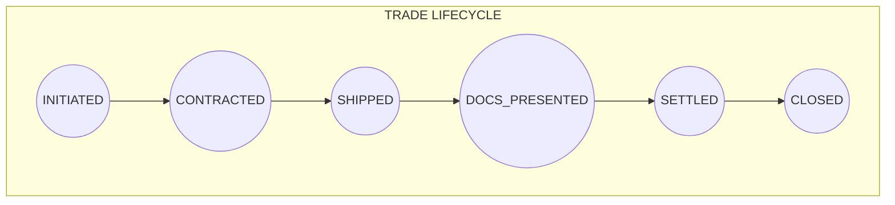

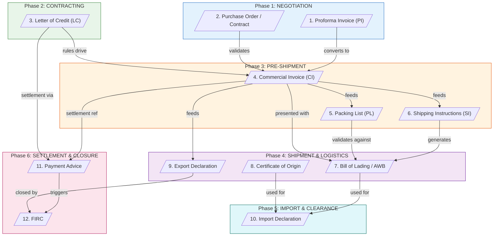

---

## 2. Document Dependency Graph

Shows how each document feeds into or validates other documents.

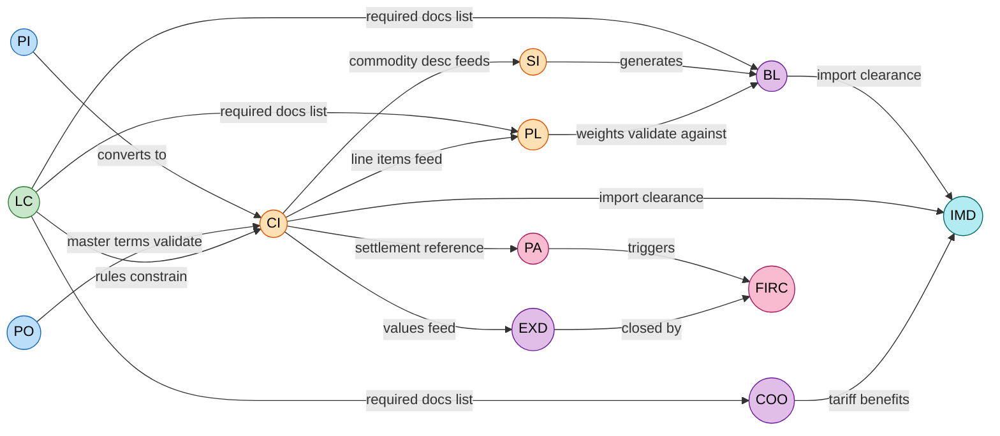

---

## 3. Role Participation Matrix (Swim Lane)

Shows which role is responsible for each action across the trade lifecycle.

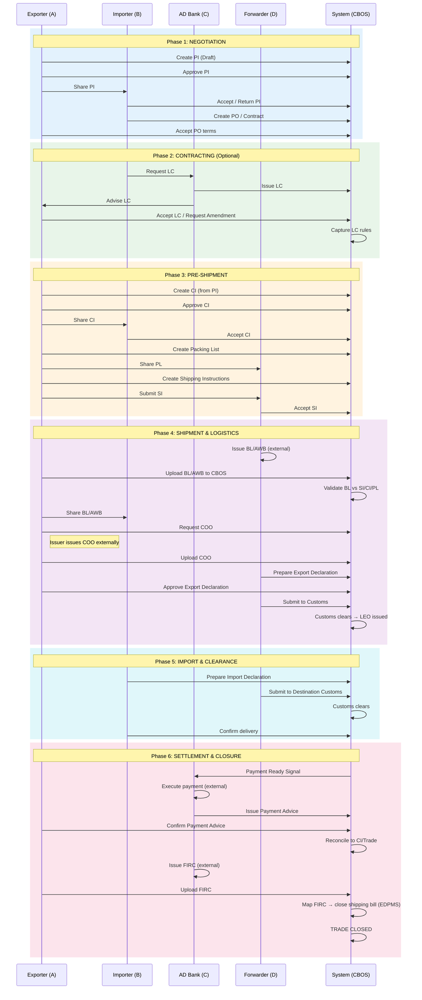

---

## 4. Individual Document State Machines

### 4.1 Proforma Invoice (PI)

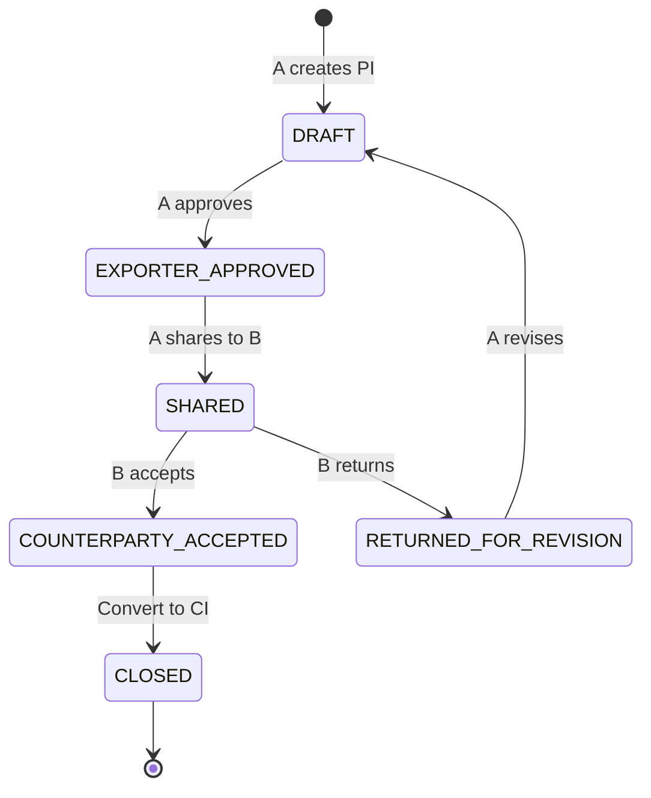

### 4.2 Purchase Order / Sales Contract

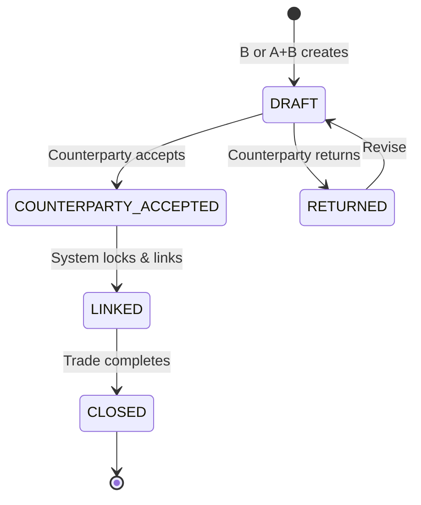

### 4.3 Letter of Credit (LC)

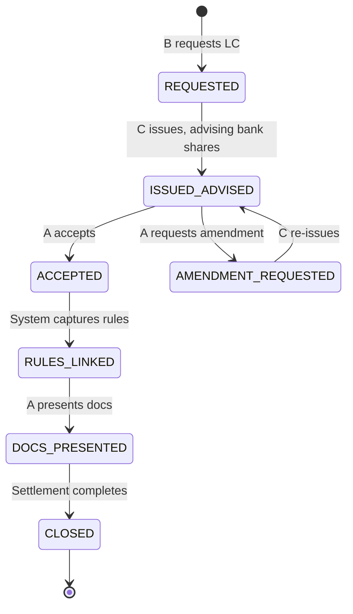

### 4.4 Commercial Invoice (CI)

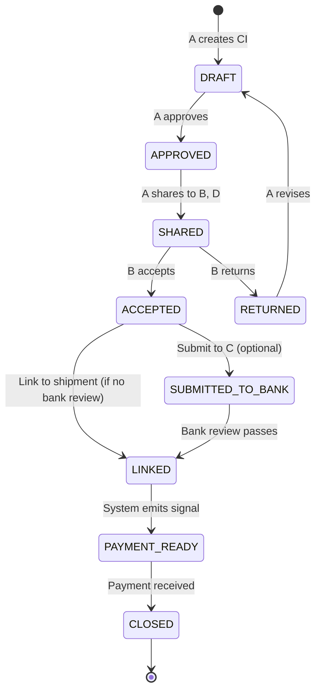

### 4.5 Packing List (PL)

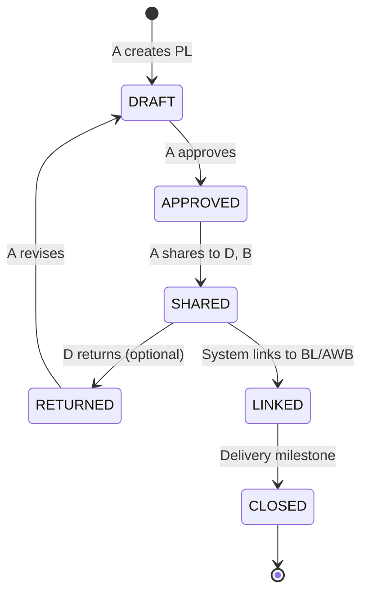

### 4.6 Shipping Instructions (SI)

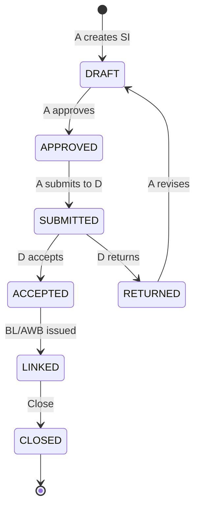

### 4.7 Bill of Lading / Air Waybill (BL/AWB)

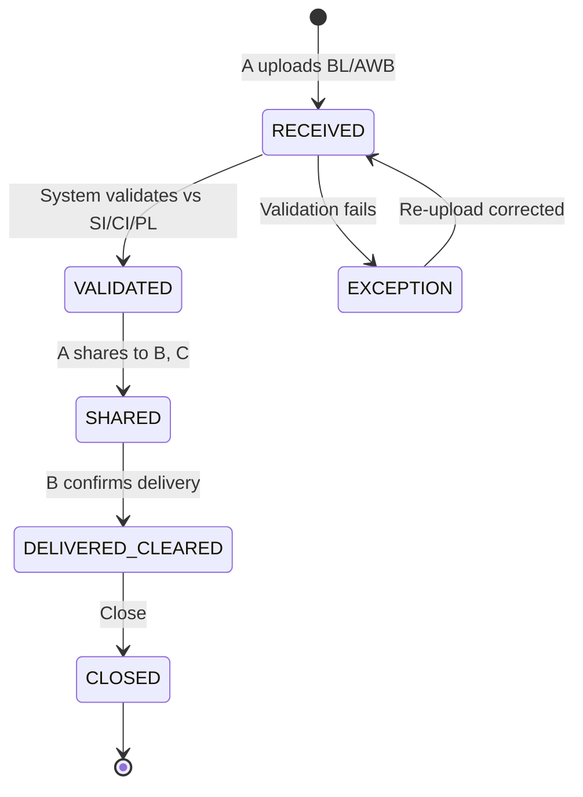

### 4.8 Certificate of Origin (COO)

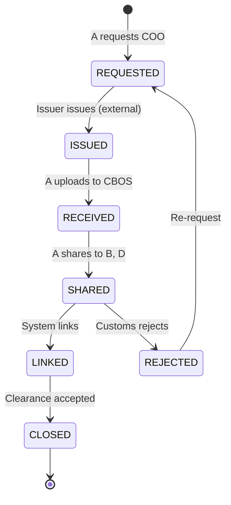

### 4.9 Export Declaration / Shipping Bill (India)

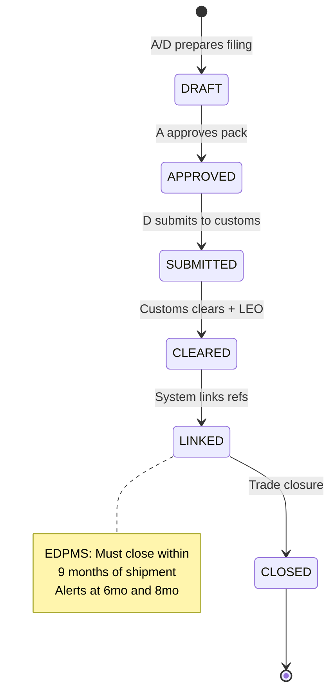

### 4.10 Import Declaration / Bill of Entry

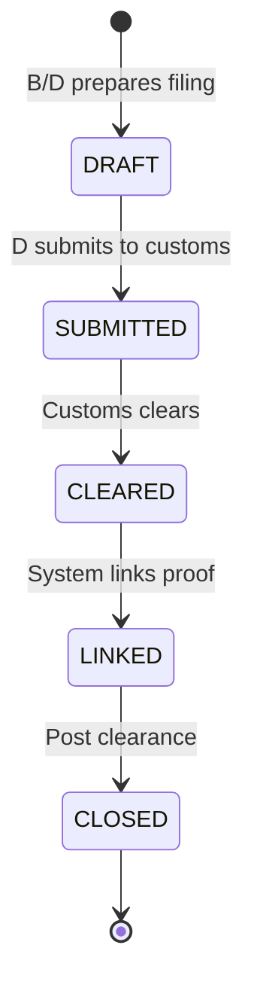

### 4.11 Payment Advice / Bank Credit Confirmation

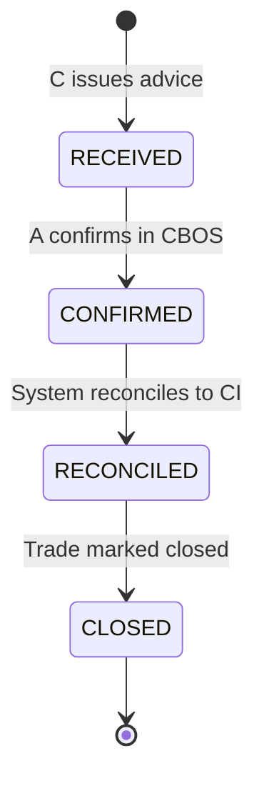

### 4.12 FIRC (Bank-issued)

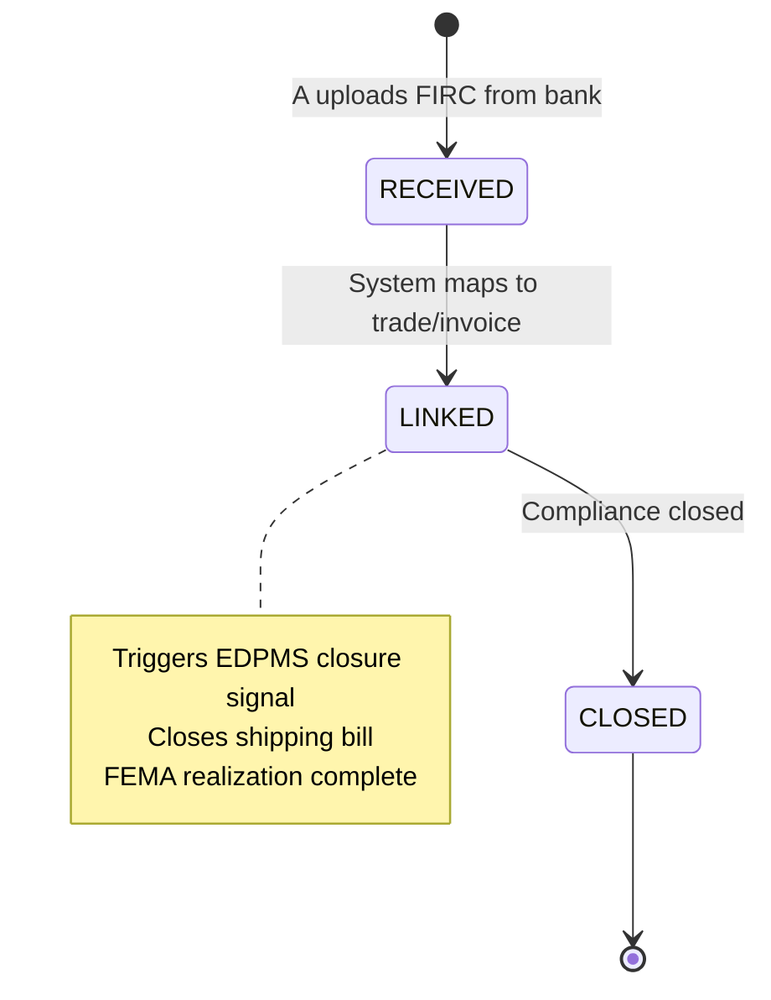

---

## 5. Trade Milestones & Document Triggers

Shows how individual document state changes drive trade-level milestone progression.

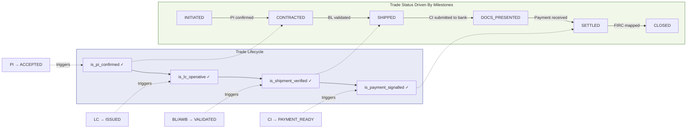

---

## 6. EDPMS Compliance Timeline (India)

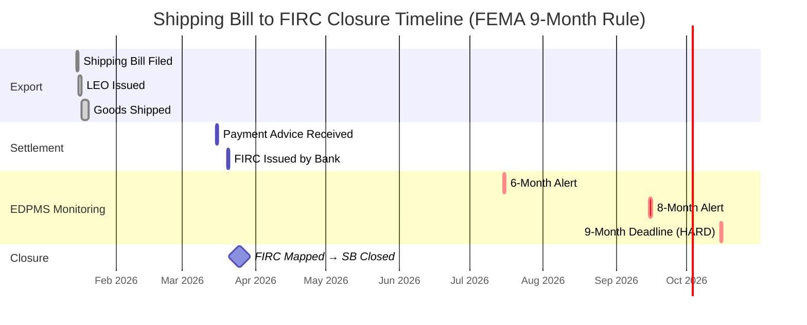
